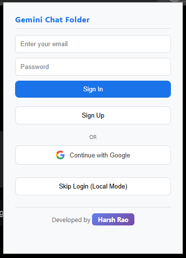
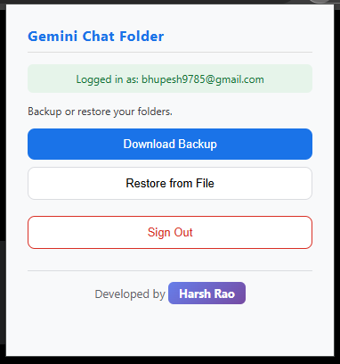

# 📁 Gemini Chat Folders (Synchronized)

> **Organize your Google Gemini chats into custom folders with seamless cloud synchronization.**
> *Never lose a specialized chat again.*

  

---

## 🚀 Overview

**Gemini Chat Folders** is a powerful Chrome Extension that supercharges your [Google Gemini](https://gemini.google.com) experience. It allows you to create custom folders, organize your chat history via drag-and-drop, and—most importantly—**sync your organization across all your devices** using a built-in Supabase backend.

Unlike other extensions, this one comes **pre-configured**. Just install and start organizing!

## ✨ Key Features

*   **📂 Custom Folders:** Create, rename, and delete folders to categorize your chats (e.g., "Coding", "Marketing", "Research").
*   **🎨 Color Coding:** Assign custom colors and icons to folders for quick visual recognition.
*   **☁️ Cloud Sync:** Your folders and chat assignments are saved to the cloud. Open Gemini on another PC, and your structure is right there.
*   **🖱️ Drag & Drop:** Easily move chats into folders with a smooth drag-and-drop interface.
*   **🔒 Secure Auth:** Sign in with Google or Email to protect your data.
*   **⚡ Plug & Play:** No backend setup required. The extension connects to a public Supabase instance out of the box.

---

## 🛠️ Installation

This extension is open-source and can be installed directly from GitHub.

### 1. Download the Code
*   Click the **Create Fork** or **Code -> Download Zip** button above.
*   OR run this in your terminal:
    ```bash
    git clone https://github.com/theharshrao/gemini-chat-folder.git
    ```

### 2. Load into Chrome
1.  Open Chrome and navigate to `chrome://extensions`.
2.  Enable **Developer Mode** (toggle in the top-right corner).
3.  Click **Load Unpacked**.
4.  Select the folder where you cloned/downloaded this repository.

### 3. Usage
1.  Go to [gemini.google.com](https://gemini.google.com).
2.  You will see a new **"Folders"** sidebar or button.
3.  Click the extension icon to **Sign In** (Required for Cloud Sync).
4.  Start dragging your chats into folders!

---

## 📸 Screenshots

<p align="center">
  
  &nbsp; &nbsp;
  
</p>

---

## 🏗️ Tech Stack

*   **Frontend:** Vanilla JavaScript (No heavy frameworks, lightweight performance).
*   **Backend:** [Supabase](https://supabase.com) (PostgreSQL Database & Auth).
*   **Authentication:** Supabase Auth (Email & Google).
*   **Sync:** Chrome Storage API + Real-time Database polling.

---

## 🤝 Contributing

Contributions are welcome! If you want to improve the UI or add features:
1.  Fork the project.
2.  Create your feature branch (`git checkout -b feature/AmazingFeature`).
3.  Commit your changes (`git commit -m 'Add some AmazingFeature'`).
4.  Push to the branch (`git push origin feature/AmazingFeature`).
5.  Open a Pull Request.

---

## 📝 License

Distributed under the MIT License. See `LICENSE` for more information.

---

<p align="center">
  Created with ❤️ by <a href="https://github.com/theharshrao">Harsh Rao</a>
</p>
